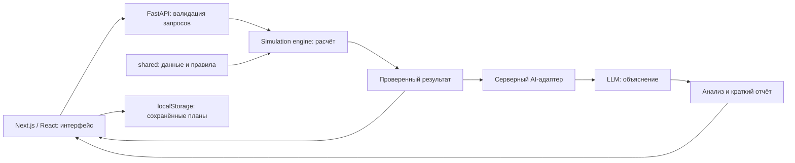

# AKIM AI — «Аким на 5 часов»

**Пять решений. Бюджет 100. Будущее пяти районов Астаны.**

Учебный AI-симулятор городского управления для **HackAlem**. Команда **LODZ POLSKA**.

Пользователь выбирает городские инициативы, распределяет ограниченный бюджет и сравнивает последствия для транспорта, экологии, социальной инфраструктуры, безопасности и городских сервисов. Расчётный движок определяет **Astana Quality of Life Score**, а AI объясняет сильные стороны, риски и компромиссы выбранного плана.

> Все исходные данные и эффекты мероприятий синтетические. Это учебная модель для сравнения сценариев, а не прогноз реального развития Астаны.

[Возможности](#что-реализовано) · [Как работает](#как-работает-решение) · [Технологии](#технологии) · [Запуск](#установка-и-запуск) · [Развёртывание](#развёртывание) · [Проверка жюри](#как-проверить-решение) · [Данные](#данные-и-интеграции) · [Архитектура](#архитектура) · [Публикация](#опубликованная-версия)

## Статус проекта

В `feature/simulation` собраны **frontend, backend, AI и отчёты** для совместного запуска. Интеграция опубликована в [PR #3][backend-pr]; до его слияния используйте эту ветку. Не нужно переносить каталоги вручную или подключать прямые AI-роутеры.

По умолчанию frontend работает в демонстрационном режиме. Для полного сценария включите `live` и запустите backend. Числовые расчёты доступны без внешнего сервиса; настоящий AI требует собственного ключа и доступной модели в локальном `backend/.env`.

Серверный советник подключён через проверяющий адаптер `/api/ai/advice`: принимает 0–4 решения, получает кандидатов из серверного каталога и проверяет каждое предложение валидатором. В интерфейсной демонстрации используются анализ полного плана и проверенная замена; отдельной панели советника пока нет. Совместный AI-анализ двух планов ещё не реализован; соответствующий frontend-флаг остаётся выключенным.

Проверки и их ограничения описаны в [отчёте интеграции][integration-checks]. Локальные проверки с контролируемым AI-провайдером не подтверждают доступность внешнего API или успешность GitHub Actions.

## Для кого и зачем

Симулятор предназначен для городских управленцев, аналитиков и участников учебных команд. Он помогает увидеть, почему максимальное улучшение среднего показателя не всегда означает равномерное развитие города: в итоговой оценке учитываются слабейший район и критически низкие показатели.

Один набор данных и единые правила делают сценарии сопоставимыми. Пользователь видит стоимость, задержку эффекта, изменения по районам и объяснение результата, а затем может проверить другую комбинацию решений.

## Что реализовано

- **Планирование:** пять районов, каталог из 14 мероприятий, поиск и фильтры, бюджет, пять слотов решений, районный и общегородской охват.
- **Последствия:** показатели до/после, оценка города и районов, критические значения, синергии, задержки и рассчитанные сервером вклады мероприятий.
- **Объяснение:** AI-модуль формирует сильные стороны, риски, компромиссы и рекомендации на основе рассчитанных фактов. Ошибка AI не должна блокировать числовой результат.
- **Сравнение:** интерфейс хранит до 12 сценариев в браузере, сравнивает два выбранных плана и выгружает результат в JSON.
- **Поиск улучшения:** backend проверяет допустимые варианты с заменой одного решения. Это поиск лучшей одной замены, а не доказательство глобально оптимального плана.
- **Интерфейс:** адаптивная компоновка, диаграммы, схема районов, анимации с поддержкой `prefers-reduced-motion`, управление диалогами и схемой с клавиатуры.

Подробные границы реализации: [frontend README][frontend-readme], [общий API-контракт][api-contract], [AI README][ai-readme].

## Как работает решение

1. **Входные данные:** сервер загружает из `shared/` исходные показатели пяти районов, каталог 14 мероприятий, бюджет 100 и правила модели. Пользователь видит их на экране планирования.
2. **Выбор:** пользователь составляет план из пяти мероприятий и указывает районы для локальных мер. Во время выбора получает предварительный расчёт и сообщения о нарушенных ограничениях.
3. **Проверка:** backend проверяет бюджет, количество и уникальность мер, охват, лимит направлений и несовместимости. Недопустимый набор возвращает причины отказа без официального Score.
4. **Расчёт:** при финализации сервер повторно проверяет план, учитывает задержки, эффекты и синергии, затем вычисляет показатели районов и итоговый Score. Числа возвращаются в интерфейс для сравнения «до / после».
5. **AI-объяснение:** отдельный запрос передаёт выбранный сценарий серверу. Сервер заново рассчитывает решения и передаёт проверенные факты AI-модулю; интерфейс получает сильные стороны, риски, компромиссы и рекомендации с обоснованиями.
6. **Результат:** пользователь изучает показатели и объяснение, сохраняет план в браузере, экспортирует JSON или сравнивает его с другим сохранённым сценарием.

Это сценарий режима `live`. В `mock` используются локальные данные и сохранённый ответ контрольного примера; сетевой AI-вызов и расчёт произвольных планов не выполняются.

## Технологии

| Компонент                | Подтверждённые технологии                                                                        |
| ------------------------ | ------------------------------------------------------------------------------------------------ |
| Языки                    | TypeScript и JavaScript на frontend; Python на backend; CSS; JSON для данных и контрактов        |
| Интерфейс                | Next.js **16.3.6** (App Router), React **19.3.0**, TypeScript **6.0.3**, Tailwind CSS **4.3.3**  |
| Компоненты и графики     | Radix UI, Recharts, Lucide; Zod для проверки ответов API                                         |
| Сервер                   | FastAPI **0.141.1**, Pydantic **2.13.5**, Uvicorn **0.53.0**, python-dotenv                      |
| AI                       | OpenAI Python SDK **3.19.0**, **Responses API**, структурированные ответы по Pydantic-схеме      |
| Проверки                 | Vitest, TypeScript, ESLint; pytest, Hypothesis, Ruff; workflow backend-проверок в GitHub Actions |
| Локальная инфраструктура | npm, Python venv; Dockerfile и Compose для расчётного API; localStorage для сохранённых планов   |

В [AI-провайдере][ai-provider] значение модели по умолчанию — **`gpt-6-astra`**. Его можно изменить через `OPENAI_MODEL`; для запуска требуется доступ к выбранной модели в API-проекте. Это значение из кода, а не обещание доступности модели любому аккаунту. Модель объясняет результат; математический движок не использует LLM для расчёта Score.

Версии взяты из [frontend/package.json][frontend-package], [backend/requirements.txt][runtime-requirements] и [backend/requirements-ai.txt][ai-requirements]. Frontend устанавливается по `package-lock.json`; Python-зависимости закреплены в requirements-файлах.

## Установка и запуск

Нужны Git, **Python 3.12**, **Node.js 22.20+** и npm. Из одной общей копии проекта:

```bash
git clone --branch feature/simulation https://github.com/BAITC-Hacks/hack-921839cc-lodz-polska.git akim-ai
cd akim-ai
```

### 1. Backend

Windows PowerShell, из корня проекта:

```powershell
py -3.12 -m venv .venv
.\.venv\Scripts\python.exe -m pip install -r backend/requirements-dev.txt
.\.venv\Scripts\python.exe -m uvicorn app.main:app --app-dir backend --host 127.0.0.1 --port 8000
```

Linux / macOS:

```bash
python3 -m venv .venv
source .venv/bin/activate
python -m pip install -r backend/requirements-dev.txt
python -m uvicorn app.main:app --app-dir backend --host 127.0.0.1 --port 8000
```

`requirements-dev.txt` включает AI и инструменты проверки. Для запуска без тестовых инструментов используйте `backend/requirements-ai.txt`. Backend читает `shared/`; не отделяйте эти папки.

Проверка: [health](http://127.0.0.1:8000/api/health) и [Swagger UI](http://127.0.0.1:8000/docs).

### 2. Frontend

В другом терминале, из корня той же копии:

```bash
cd frontend
npm ci
```

Создайте локальный `frontend/.env.local`:

```dotenv
NEXT_PUBLIC_API_MODE=live
NEXT_PUBLIC_API_BASE_URL=http://127.0.0.1:8000
NEXT_PUBLIC_ENABLE_RECOMMENDATIONS=true
NEXT_PUBLIC_ENABLE_AI_COMPARISON=false
```

```bash
npm run dev
```

Откройте [http://127.0.0.1:3000](http://127.0.0.1:3000). Backend разрешает этот origin и `http://localhost:3000`. Для production: `npm run build`, затем `npm start`; сначала остановите dev-сервер на том же порту. После изменения `NEXT_PUBLIC_*` перезапустите dev-сервер или пересоберите production.

Для просмотра интерфейса без backend оставьте `NEXT_PUBLIC_API_MODE=mock` или не создавайте `.env.local`. Только контрольный пример имеет сохранённый результат; AI-текст помечен «Шаблон · не AI».

### 3. Настройка настоящего AI

Перед запуском backend создайте локальный `backend/.env` по `backend/.env.example` и заполните собственный действующий ключ и доступную модель:

```dotenv
OPENAI_API_KEY=YOUR_API_KEY
OPENAI_MODEL=gpt-6-astra
```

Ключ не отправляется во frontend и не коммитится. Значения процесса имеют приоритет над файлом. Без ключа AI возвращает понятный HTTP 503, а расчёты и поиск замены работают. `aiConfigured` в health означает наличие настроенного адаптера, а не успешный вызов модели.

Сервер самостоятельно пересчитывает планы до обращения к AI. Дополнительное подключение `create_ai_router()` или `create_report_router()` не требуется: оно создало бы дублирующиеся маршруты с обходом пересчёта.

SDK ждёт до 45 секунд без автоматических повторов; frontend — 60 секунд на AI и 20 на расчётные запросы. Reverse proxy для AI должен допускать не менее 60 секунд.

### Переменные окружения

| Переменная                           | Где                        | Назначение                                     |
| ------------------------------------ | -------------------------- | ---------------------------------------------- |
| `NEXT_PUBLIC_API_MODE`               | frontend/.env.local        | mock или live                                  |
| `NEXT_PUBLIC_API_BASE_URL`           | frontend/.env.local        | Origin backend без /api                        |
| `NEXT_PUBLIC_ENABLE_RECOMMENDATIONS` | frontend/.env.local        | true: поиск проверенной замены                 |
| `NEXT_PUBLIC_ENABLE_AI_COMPARISON`   | frontend/.env.local        | false: совместный AI-маршрут ещё не реализован |
| `CORS_ORIGINS`                       | backend/.env или окружение | Разрешённые origin через запятую               |
| `OPENAI_API_KEY`                     | backend/.env или окружение | Серверный ключ провайдера                      |
| `OPENAI_MODEL`                       | backend/.env или окружение | Доступная аккаунту модель                      |

`NEXT_PUBLIC_*` видны браузеру; секреты в них недопустимы. Docker Compose запускает только backend. Для него: `docker compose --env-file backend/.env up --build`; frontend запускается отдельно командами выше.

## Развёртывание

В репозитории нет привязки к конкретной платформе и нет подтверждённого публичного URL. Ниже приведена воспроизводимая схема развёртывания существующих компонентов: backend как Docker-сервис, frontend как Next.js-приложение. Сначала публикуется backend, потому что его HTTPS-адрес нужен при сборке frontend.

### Вариант A: Render для backend и Vercel для frontend

#### 1. Развернуть backend в Render

1. Создайте в Render новый **Web Service** из этого GitHub-репозитория.
2. Выберите ветку `feature/simulation` до слияния PR #3 или `main` после слияния.
3. Выберите **Docker** как runtime, корень репозитория — `.`, путь к Dockerfile — `backend/Dockerfile`.
4. Добавьте переменные окружения:

   ```dotenv
   OPENAI_API_KEY=ваш_секретный_ключ
   OPENAI_MODEL=gpt-6-astra
   CORS_ORIGINS=https://ИМЯ_FRONTEND.vercel.app
   ```

   `OPENAI_API_KEY` храните только как secret. Если AI пока не нужен, ключ можно не задавать: симуляция продолжит работать, а AI-маршрут вернёт 503.

5. Запустите deploy. Контейнер слушает `0.0.0.0:8000`; Render должен определить порт автоматически.
6. Проверьте `https://ИМЯ_BACKEND.onrender.com/api/health`. Ожидается JSON со `status: "ok"`. Swagger доступен по `/docs`.

Если точный домен Vercel ещё неизвестен, сначала разверните frontend, затем установите фактический origin в `CORS_ORIGINS` и повторно разверните backend. Указывайте origin без завершающего `/`; несколько адресов разделяются запятыми.

#### 2. Развернуть frontend в Vercel

1. Импортируйте тот же репозиторий в Vercel.
2. Выберите ту же ветку, что и для backend.
3. Укажите **Root Directory**: `frontend`. Framework Preset должен определиться как Next.js.
4. Добавьте переменные окружения для Production:

   ```dotenv
   NEXT_PUBLIC_API_MODE=live
   NEXT_PUBLIC_API_BASE_URL=https://ИМЯ_BACKEND.onrender.com
   NEXT_PUBLIC_ENABLE_RECOMMENDATIONS=true
   NEXT_PUBLIC_ENABLE_AI_COMPARISON=false
   ```

5. Запустите deploy. Vercel выполнит `npm ci` и `npm run build`.
6. Откройте выданный Vercel URL и пройдите сценарий из раздела [«Как проверить решение»](#как-проверить-решение).

`NEXT_PUBLIC_API_BASE_URL` задаётся без `/api`. Эти переменные встраиваются во frontend во время сборки, поэтому после их изменения нужен **Redeploy**. Frontend и backend должны использовать HTTPS, иначе браузер заблокирует запросы как mixed content.

### Вариант B: backend через Docker на VPS

На сервере с Git и Docker:

```bash
git clone --branch feature/simulation https://github.com/BAITC-Hacks/hack-921839cc-lodz-polska.git akim-ai
cd akim-ai
cp backend/.env.example backend/.env
```

Заполните `backend/.env`, затем запустите:

```bash
docker compose --env-file backend/.env up -d --build
docker compose ps
curl http://127.0.0.1:8000/api/health
```

Compose намеренно публикует backend только на `127.0.0.1:8000`. Для доступа из интернета поставьте перед ним Nginx, Caddy или другой reverse proxy с HTTPS и направьте публичный домен на `http://127.0.0.1:8000`. В `CORS_ORIGINS` укажите публичный HTTPS-origin frontend. Не открывайте и не коммитьте `backend/.env`.

Frontend удобнее развернуть в Vercel по инструкции выше. Если он запускается на том же VPS, соберите его после создания `frontend/.env.local`:

```bash
cd frontend
npm ci
npm run build
npx next start --hostname 0.0.0.0 --port 3000
```

Для постоянной работы используйте системный менеджер процессов и reverse proxy с HTTPS. После развёртывания проверьте `/api/health`, загрузку каталога, финализацию сценария и AI-анализ. Наличие `aiConfigured: true` подтверждает конфигурацию адаптера, но финально AI проверяется только реальным запросом из интерфейса.

## Как проверить решение

### Демонстрация для жюри

1. Открыть главную и нажать **«Начать управление»**.
2. Выбрать Нуру на схеме: изучить показатели, открыть детали мероприятия и его задержку эффекта.
3. Нажать **«Попробовать пример»**: пять решений, расход 95, остаток 5.
4. Нажать **«Рассчитать результат»**: показать Score **52.56 → 56.54**, изменения по районам и исчезновение критических показателей.
5. Показать объяснение: в mock это явно обозначенный шаблон; настоящий AI демонстрируется при настроенном серверном ключе.
6. Нажать «Улучшить одной заменой»: Score 56.54307 → 57.20556, расход 95 → 100. Проверить не только рост Нуры, но и потерю Сарыарки. Сохранить исходный, применить замену и пересчитать итог.
7. Сохранить сценарий, открыть сравнение и экспортировать JSON. Для сравнения разных рассчитанных планов использовать backend; одинаковые планы должны давать одинаковые результаты.

### Контрольный запрос

| Мера                      | Где применяется |    Стоимость |
| ------------------------- | --------------- | -----------: |
| M7 — школы и детсады      | Нура            |           24 |
| M8 — поликлиника          | Нура            |           20 |
| M10 — освещение и камеры  | Нура            |           12 |
| M12 — платформа обращений | Весь город      |           14 |
| M5 — чистое топливо       | Сарыарка        |           25 |
| **Итого**                 | **5 решений**   | **95 / 100** |

Тело запроса к `POST /api/scenario/finalize`:

```json
{
  "decisions": [
    { "measureId": "M7", "districtId": "nura" },
    { "measureId": "M8", "districtId": "nura" },
    { "measureId": "M10", "districtId": "nura" },
    { "measureId": "M12" },
    { "measureId": "M5", "districtId": "saryarka" }
  ]
}
```

| Проверяемая величина            |       До |    После |
| ------------------------------- | -------: | -------: |
| Astana Quality of Life Score    | 52.55768 | 56.54307 |
| Среднее по населению            |  56.8624 |  58.0776 |
| Оценка слабейшего района — Нуры |    49.18 |  52.9625 |
| Количество индикаторов ниже 40  |        2 |        0 |

Изменение Score — **+3.98539**, бюджетный остаток — **5**. UI округляет числа только для отображения. Запрос и ответы для автоматической проверки доступны в [example-scenario.json][example-scenario] и [shared/fixtures][fixtures].

Дополнительная проверка через Swagger: отправьте в `POST /api/simulate` набор M1/Есиль + M3/Нура. Эти меры несовместимы даже в разных районах; ожидается `validation.status=invalid` и `after=null`. Для проверки влияния выбора измените район M5 в полном контрольном плане и повторите финализацию: получите новый серверный расчёт вместо сохранённого mock-ответа.

## Данные и интеграции

| Источник / интеграция               | Что используется                                                                                  | Где подтверждено                                                |
| ----------------------------------- | ------------------------------------------------------------------------------------------------- | --------------------------------------------------------------- |
| Синтетический датасет организаторов | 5 районов, доли населения и 10 исходных индикаторов                                               | [shared/districts.json][districts]                              |
| Каталог мероприятий                 | 14 мер: стоимость, охват, задержки и эффекты                                                      | [shared/measures.json][measures]                                |
| Правила симуляции                   | Бюджет, веса, пороги, синергии, несовместимости и версия модели                                   | [shared/model.json][model]                                      |
| Контрольные примеры                 | Входной план и воспроизводимые ответы расчётного движка                                           | [example-scenario.json][example-scenario], [fixtures][fixtures] |
| Собственный HTTP API                | Обмен frontend с FastAPI: JSON, схемы OpenAPI и описанный контракт                                | [shared/api-contract.md][api-contract]                          |
| OpenAI Responses API                | Только серверный AI-анализ: рассчитанный сценарий и необязательный вопрос; ответ в заданной схеме | [openai_provider.py][ai-provider]                               |
| Браузерное хранилище                | Черновик и сохранённые сценарии на устройстве пользователя                                        | [frontend/lib/storage.ts][storage]                              |

В проекте нет подключения к реестрам акимата, живой городской статистике, GIS-сервисам или картографическому API. Схема районов локальная. Данные модели хранятся в репозитории; для расчёта не требуется внешний сервис. AI-анализ отправляет рассчитанные данные сценария внешнему провайдеру и требует отдельного API-доступа.

Источник и трактовка исходного задания описаны в [разборе требований][backend-requirements]. Fixtures — контрольные данные для проверки, а примеры ответов AI в его модуле не следует выдавать за новые живые ответы модели.

## Расчётная модель

### Данные и правила

Пять районов: **Есиль, Алматы, Сарыарка, Байконур и Нура**. Доли населения — 27%, 24%, 20%, 13% и 16% соответственно. В каждом районе десять индикаторов от 0 до 100; **чем выше, тем лучше**, включая транспорт и безопасность.

| Направление               | Индикаторы                                        | Веса в оценке района |
| ------------------------- | ------------------------------------------------- | -------------------- |
| Транспорт                 | T1 — разгрузка дорог; T2 — общественный транспорт | 0.10; 0.10           |
| Экология                  | E1 — озеленение; E2 — качество воздуха            | 0.09; 0.11           |
| Социальная инфраструктура | S1 — школы и детсады; S2 — первичная медицина     | 0.11; 0.11           |
| Безопасность              | B1 — улицы; B2 — дорожное движение                | 0.09; 0.09           |
| Городские сервисы         | C1 — надёжность ЖКХ; C2 — обращения жителей       | 0.10; 0.10           |

Официальный результат выдаётся только при соблюдении ограничений:

- бюджет **не более 100**, ровно **5 разных мероприятий**;
- каждое мероприятие выбирается не более одного раза, даже для разных районов;
- не более **2 мероприятий одного направления**;
- для районной меры указан район; общегородская применяется ко всем районам;
- нет несовместимых сочетаний: **M1 + M3** в любых районах, **M4 + M7** в одном районе, **M5 + M13** в одном районе.

По подробному датасету не требуется выбирать ровно по одной мере из каждого направления: действует предел «не более двух». Краткое ТЗ формулирует пять направлений менее подробно; эта трактовка зафиксирована для согласования с организаторами. Остаток бюджета не добавляет баллов.

### Формулы

Горизонт — **8 кварталов**, `L` — задержка мероприятия в кварталах:

```text
Учтённый эффект = полный эффект × (8 − L) / 8
Показатель после = clip(исходный + сумма эффектов + синергии, 0, 100)
Оценка района D = сумма(вес индикатора × его значение)
Среднее Davg = сумма(доля населения района × D)
Score = 0.7 × Davg + 0.3 × min(D) − Ncrit
```

`Ncrit` — количество пар «район / индикатор» со значением **строго ниже 40**. Значение 40 не штрафуется. Эффекты сначала суммируются, затем ограничиваются диапазоном; промежуточного округления нет. Порядок решений не меняет результат.

Фиксированные синергии добавляются без коэффициента задержки: **M1 + M2 → T1 +2** в районе M1; **M10 + M12 → B1 +2** в районе M10; **M5 + M6 → E2 +2** в районе M5.

Движок использует точные рациональные числа `Fraction`, а в JSON отдаёт обычные числа. Вклады мероприятий рассчитываются методом Шепли: усреднением вклада по порядкам добавления. Их сумма соответствует изменению Score, включая синергии и нелинейный штраф.

Единые данные: [districts.json][districts], [measures.json][measures], [model.json][model]. Версия модели и контрольная сумма данных позволяют отличать результаты разных редакций. При невалидном плане официальный Score отсутствует (`null`), а ответ содержит причины отказа.

## Архитектура



Схема показывает устройство объединённого приложения; состояние интеграции указано выше. **Числа рассчитывает backend. AI объясняет уже проверенные факты.** Браузер не является источником стоимости, эффектов или официального Score.

Структура объединённой сборки:

```text
frontend/                   страницы, компоненты, HTTP-адаптер, типы, тесты
backend/app/main.py          сборка приложения FastAPI и CORS
backend/app/api/simulation/  HTTP-маршруты и проверяющий AI-адаптер
backend/app/models/          схемы запросов и ответов
backend/app/simulation/      данные, ограничения, расчёт, поиск улучшения
backend/app/ai/              AI-схемы, prompts, service и провайдер
backend/app/report/          краткий структурированный отчёт
backend/tests/              проверки модели и API
backend/docs/               разбор требований и принятые решения
shared/                     датасет, модель, контракт, OpenAPI, fixtures
```

### API

Расчётные запросы и ответы используют `camelCase`; текущий AI-запрос содержит `scenario` с полями `snake_case`. Полная схема — [API-контракт][api-contract]; при работающем сервере доступны `/docs` и `/openapi.json`.

| Метод | Маршрут                                             | Назначение                                                                 |
| ----- | --------------------------------------------------- | -------------------------------------------------------------------------- |
| GET   | `/api/health`                                       | Состояние приложения, версия и контрольная сумма модели                    |
| GET   | `/api/districts`, `/api/measures`, `/api/bootstrap` | Данные районов, каталог и стартовые параметры                              |
| POST  | `/api/simulate`                                     | Предварительный расчёт для 0–5 решений                                     |
| POST  | `/api/scenario/finalize`                            | Повторная проверка и официальный результат пяти решений                    |
| POST  | `/api/recommend`                                    | Проверенная замена одного решения                                          |
| POST  | `/api/ai/analyze`                                   | Анализ после серверного пересчёта решений из `scenario`; выводы с evidence |
| POST  | `/api/ai/advice`                                    | Советы для 0–4 решений; каталог и валидация только на сервере              |
| POST  | `/api/explain`                                      | Анализ по компактному запросу `{decisions, question?}`                     |
| POST  | `/api/report/executive-brief`                       | Структурированный отчёт по проверенному сценарию                           |

Preview не является официальной финализацией. Бизнес-ошибка `simulate/finalize` возвращается как HTTP 200 с `validation.status=invalid` и `after=null`; неверный формат запроса — HTTP 422; недоступный AI — HTTP 503. Клиент должен проверять содержимое ответа, а не только HTTP-статус.

## Проверки

Все команды выполняются в одной копии проекта после установки зависимостей. Frontend, из `frontend/`:

```bash
npm test
npm run typecheck
npm run lint
npm run build
```

Backend, с активированным Python-окружением:

```bash
cd backend
python -m pytest --cov=app --cov-report=term-missing
python -m ruff check app/api/simulation app/models app/simulation app/main.py tests scripts
python -m ruff format --check app/api/simulation app/models app/simulation app/main.py tests scripts
cd ..
python backend/scripts/check_ai_contract.py
node backend/scripts/check_frontend_contract.mjs
python backend/scripts/export_fixtures.py
git diff --exit-code -- shared/fixtures shared/openapi.json
```

Для проверки настоящего frontend-запроса и FastAPI-ответа задайте `AKIM_FRONTEND_REQUEST` абсолютным путём к временному `request.json` вне репозитория. Запустите Node-проверку, затем Python-проверку AI-контракта и снова Node-проверку. Первый запуск сохраняет запрос из реального TypeScript-адаптера; Python передаёт его через FastAPI; второй Node-запуск проверяет возвращённый ответ. В CI этот путь автоматически задаётся через `runner.temp`. Без этой переменной один дополнительный тест обмена пропускается; остальные тесты работают.

Проверенная объединённая версия: **93 backend-теста без пропусков**, **49 frontend-тестов**, **25 тестов AI-контракта**, TypeScript, ESLint, Ruff и production-сборка. Покрытие backend-owned строк — 99%; AI/report исключены из этой метрики. Числа тестов не складываются: 25 AI-тестов входят в общий backend-набор.

Проверки AI используют контролируемый провайдер и не расходуют внешний API. Настоящий вызов модели требует локального ключа. Его доступность не следует выводить из успешных unit-тестов. Свежие результаты CI и браузерного прогона — в [отчёте интеграции][integration-checks].

Workflow проверяет объединённый проект: Python и frontend-зависимости, оба API-адаптера, тесты, линтеры, TypeScript, сборку и воспроизводимость fixtures/OpenAPI. Неудачный запуск GitHub Actions до старта шагов не считается успешной проверкой кода.

### Сквозная проверка перед сдачей

- [ ] На чистом checkout зависимости устанавливаются по указанным командам.
- [ ] Сервер отдаёт 5 районов и 14 мероприятий; базовый Score равен `52.55768`.
- [ ] Контрольный запрос даёт `56.54307`, расход 95, остаток 5, ноль критических показателей.
- [ ] Изменённый допустимый набор пересчитывается сервером; проверяются превышение бюджета, повторы, несовместимости и финализация неполного плана.
- [ ] AI-запрос соответствует контракту, вывод объясняет рассчитанные факты; при HTTP 503 числовой результат остаётся доступным.
- [ ] Два разных плана сохраняются и сравниваются; JSON-экспорт содержит результат выбранного плана.
- [ ] Интерфейс проверен на мобильном экране и с клавиатуры, ошибки сети видимы пользователю.

### Если что-то не запускается

| Симптом                                     | Что проверить                                                                                              |
| ------------------------------------------- | ---------------------------------------------------------------------------------------------------------- |
| Нет папки `frontend` или `backend`          | В `main` пока только документация; выберите нужную ветку из инструкции                                     |
| UI работает, но свой план не рассчитывается | Включён `mock`; подключите расчётный API и перезапустите frontend                                          |
| Ошибка сети / CORS                          | Backend запущен на 8000; base URL без `/api`; origin фронтенда разрешён                                    |
| AI возвращает 422                           | Согласованы ли запрос и ответ AI-адаптера с текущим общим контрактом                                       |
| AI возвращает 503                           | Подключён ли AI-модуль, установлен ли SDK, задан ли ключ в процессе backend и доступна ли выбранная модель |
| Порт 3000 занят                             | Остановите предыдущий dev/production-сервер либо согласуйте новый порт и CORS                              |

## Критерии хакатона

Таблица связывает критерии из ТЗ с материалами и проверками проекта. Баллы — максимумы организаторов, а не заявленная оценка команды.

| Критерий                                    | Максимум | Что демонстрировать и проверять                                                                                                 |
| ------------------------------------------- | -------: | ------------------------------------------------------------------------------------------------------------------------------- |
| Соответствие задаче и работоспособность     |       25 | Единый бюджет и датасет, пять решений, ограничения, пересчёт Score и AI-объяснение; контрольный сценарий и сквозной прогон      |
| Техническая реализация                      |       25 | Разделение UI / engine / AI, серверная валидация, типизированный контракт, точная математика и обработка ошибок                 |
| README и воспроизводимость                  |       25 | Требования к окружению, команды запуска, режимы, конфигурация, контрольный JSON с ожидаемыми числами, тесты и устранение ошибок |
| Ценность и применимость решения             |       15 | Сравнение бюджетных компромиссов, улучшение слабейшего района, работа с критическими показателями и понятные объяснения         |
| Потенциал развития и оригинальность подхода |       10 | Объяснимые вклады мер, проверенная замена одного решения, учёт синергий и задержек, план развития                               |
| **Всего**                                   |  **100** | Финальная оценка зависит от работающей объединённой версии                                                                      |

## Ограничения и развитие

Текущая модель не учитывает все процессы реального города. Схема районов в интерфейсе не является точной географической картой. localStorage относится к конкретному браузеру: это не общая база и не рейтинг команд.

В текущий MVP не входят авторизация, серверное хранение, межкомандный рейтинг, неожиданные городские события и готовый экспорт PDF/PPT. Модуль Executive Brief формирует структурированные данные и Markdown; это ещё не генератор презентаций.

AI использует таймаут SDK 45 секунд без повторов; frontend ждёт 60 секунд. При недоступности провайдера интерфейс сохраняет числовой результат и предлагает повторить анализ. В текущем прогоне внешняя модель не вызывалась: локальный ключ не настроен.

Перед демонстрацией с внешним AI нужно настроить собственный ключ и повторить сценарий с выбранной моделью. Дальнейшее развитие: общие сессии команд и рейтинг, наборы городских событий, экспорт презентации, анализ чувствительности сценариев и подключение проверенных открытых данных с отдельной калибровкой модели.

## Опубликованная версия

**Подтверждённая ссылка на развёрнутое приложение в репозитории не указана.** На момент проверки поле Website пустое, GitHub Pages не включён, workflow запускает проверки объединённого проекта и не публикует сайт. Поэтому внешняя demo-ссылка здесь не приводится.

Для проверки жюри доступен [локальный запуск](#установка-и-запуск). Адреса `127.0.0.1:3000` и `127.0.0.1:8000` работают на компьютере, где запущены компоненты, и не являются deployed-версией.

## Работа команды и источники

| Зона ответственности                          | Файлы                                                              |
| --------------------------------------------- | ------------------------------------------------------------------ |
| Nurali №1 — FRONTEND                          | `frontend/**`                                                      |
| Alibek №2 — BACKEND / SIMULATION / INTEGRATOR | Расчётный backend, `shared/**`, сборка приложения и общий контракт |
| Abylay №3 — AI / REPORT                       | `backend/app/ai/**`, `backend/app/report/**`                       |

Общий [API-контракт][api-contract] согласуется до изменения форматов. Frontend не дублирует расчётный движок; AI не меняет формулу и исходные данные. Изменения общего контракта сопровождаются обновлением адаптеров и контрольных ответов, после чего повторяется сквозная проверка.

Проект опирается на четыре предоставленных документа:

1. **«HackAlem AI: “Аким на 5 часов”»** — задача, обязательные возможности и критерии оценки.
2. **«Датасет районов»** — синтетические исходные значения, мероприятия, ограничения и формулы.
3. **«План проекта»** — пользовательский сценарий и план реализации.
4. **«Чёткое разделение участников»** — границы ответственности и правила интеграции.

Разбор требований сохранён в [документации frontend][frontend-requirements] и [документации backend][backend-requirements]. Ссылки на код ниже ведут в рабочие ветки, поскольку они ещё не объединены с `main`.

[frontend-tree]: https://github.com/BAITC-Hacks/hack-921839cc-lodz-polska/tree/feature/frontend/frontend
[backend-tree]: https://github.com/BAITC-Hacks/hack-921839cc-lodz-polska/tree/feature/simulation/backend
[ai-tree]: https://github.com/BAITC-Hacks/hack-921839cc-lodz-polska/tree/feature/ai/backend/app/ai
[frontend-pr]: https://github.com/BAITC-Hacks/hack-921839cc-lodz-polska/pull/2
[backend-pr]: https://github.com/BAITC-Hacks/hack-921839cc-lodz-polska/pull/3
[ai-pr]: https://github.com/BAITC-Hacks/hack-921839cc-lodz-polska/pull/1
[frontend-readme]: https://github.com/BAITC-Hacks/hack-921839cc-lodz-polska/blob/feature/frontend/frontend/README.md
[frontend-requirements]: https://github.com/BAITC-Hacks/hack-921839cc-lodz-polska/blob/feature/frontend/frontend/REQUIREMENTS.md
[backend-requirements]: https://github.com/BAITC-Hacks/hack-921839cc-lodz-polska/blob/feature/simulation/backend/docs/requirements-analysis.md
[api-contract]: https://github.com/BAITC-Hacks/hack-921839cc-lodz-polska/blob/feature/simulation/shared/api-contract.md
[ai-readme]: https://github.com/BAITC-Hacks/hack-921839cc-lodz-polska/blob/feature/ai/backend/app/ai/README.md
[example-scenario]: https://github.com/BAITC-Hacks/hack-921839cc-lodz-polska/blob/feature/simulation/shared/example-scenario.json
[fixtures]: https://github.com/BAITC-Hacks/hack-921839cc-lodz-polska/tree/feature/simulation/shared/fixtures
[districts]: https://github.com/BAITC-Hacks/hack-921839cc-lodz-polska/blob/feature/simulation/shared/districts.json
[measures]: https://github.com/BAITC-Hacks/hack-921839cc-lodz-polska/blob/feature/simulation/shared/measures.json
[model]: https://github.com/BAITC-Hacks/hack-921839cc-lodz-polska/blob/feature/simulation/shared/model.json
[frontend-package]: https://github.com/BAITC-Hacks/hack-921839cc-lodz-polska/blob/feature/frontend/frontend/package.json
[runtime-requirements]: https://github.com/BAITC-Hacks/hack-921839cc-lodz-polska/blob/feature/simulation/backend/requirements.txt
[ai-requirements]: https://github.com/BAITC-Hacks/hack-921839cc-lodz-polska/blob/feature/simulation/backend/requirements-ai.txt
[ai-provider]: https://github.com/BAITC-Hacks/hack-921839cc-lodz-polska/blob/feature/ai/backend/app/ai/openai_provider.py
[storage]: https://github.com/BAITC-Hacks/hack-921839cc-lodz-polska/blob/feature/frontend/frontend/lib/storage.ts
[integration-checks]: backend/docs/integration-checks.md
