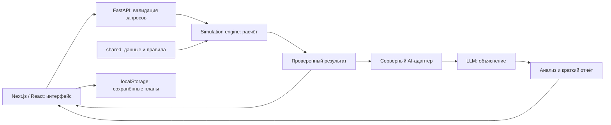

# AKIM AI — «Аким на 5 часов»

**Пять решений. Бюджет 100. Будущее пяти районов Астаны.**

Учебный AI-симулятор городского управления для **HackAlem**. Команда **LODZ POLSKA**.

Пользователь выбирает городские инициативы, распределяет ограниченный бюджет и сравнивает последствия для транспорта, экологии, социальной инфраструктуры, безопасности и городских сервисов. Расчётный движок определяет **Astana Quality of Life Score**, а AI объясняет сильные стороны, риски и компромиссы выбранного плана.

> Все исходные данные и эффекты мероприятий синтетические. Это учебная модель для сравнения сценариев, а не прогноз реального развития Астаны.

[Запуск](#запуск) · [Демонстрация](#демонстрация) · [Модель](#расчётная-модель) · [Архитектура](#архитектура) · [Проверки](#проверки) · [Критерии хакатона](#критерии-хакатона)

## Статус проекта

На **23 сентября 2026 года** модули опубликованы в отдельных ветках и ожидают объединения. В `main` пока находится общая документация. Команды ниже явно выбирают ветку с нужным кодом.

| Часть                | Что есть в коде                                                                                  | Ветка / pull request                                       |
| -------------------- | ------------------------------------------------------------------------------------------------ | ---------------------------------------------------------- |
| Frontend             | Главная, планирование, результаты, сравнение, адаптивный интерфейс и демонстрационный режим      | [`feature/frontend`][frontend-tree] · [PR #2][frontend-pr] |
| Backend / simulation | FastAPI, проверка ограничений, детерминированный расчёт, вклады мероприятий и поиск одной замены | [`feature/simulation`][backend-tree] · [PR #3][backend-pr] |
| AI / report          | Анализ рассчитанного сценария через LLM, структурированный ответ и краткий отчёт                 | [`feature/ai`][ai-tree] · [PR #1][ai-pr]                   |
| Сквозная интеграция  | Форматы frontend/backend сверены; требуются объединение модулей и проверка с провайдером         | См. [подключение компонентов](#подключение-компонентов)    |

**Режимы различаются:** демоверсия интерфейса показывает сохранённый контрольный пример; backend рассчитывает произвольные допустимые наборы; настоящий AI требует серверной настройки и завершённой интеграции. Готовность отдельных модулей не означает, что весь live-сценарий уже проверен.

## Для кого и зачем

Симулятор предназначен для городских управленцев, аналитиков и участников учебных команд. Он помогает увидеть, почему максимальное улучшение среднего показателя не всегда означает равномерное развитие города: в итоговой оценке учитываются слабейший район и критически низкие показатели.

Один набор данных и единые правила делают сценарии сопоставимыми. Пользователь видит стоимость, задержку эффекта, изменения по районам и объяснение результата, а затем может проверить другую комбинацию решений.

## Возможности

- **Планирование:** пять районов, каталог из 14 мероприятий, поиск и фильтры, бюджет, пять слотов решений, районный и общегородской охват.
- **Последствия:** показатели до/после, оценка города и районов, критические значения, синергии, задержки и рассчитанные сервером вклады мероприятий.
- **Объяснение:** AI-модуль формирует сильные стороны, риски, компромиссы и рекомендации на основе рассчитанных фактов. Ошибка AI не должна блокировать числовой результат.
- **Сравнение:** интерфейс хранит до 12 сценариев в браузере, сравнивает два выбранных плана и выгружает результат в JSON.
- **Поиск улучшения:** backend проверяет допустимые варианты с заменой одного решения. Это поиск лучшей одной замены, а не доказательство глобально оптимального плана.
- **Интерфейс:** адаптивная компоновка, диаграммы, схема районов, анимации с поддержкой `prefers-reduced-motion`, управление диалогами и схемой с клавиатуры.

Подробные границы реализации: [frontend README][frontend-readme], [общий API-контракт][api-contract], [AI README][ai-readme].

## Запуск

Репозиторий приватный: для клонирования нужен доступ к нему в GitHub. Зависимости устанавливаются из интернета. Для локальной демонстрации интерфейса и расчётов API-ключ не нужен.

### 1. Интерфейс — быстрый просмотр

Требуются **Git, Node.js 22.20+ и npm**. В новом терминале:

```bash
git clone --branch feature/frontend https://github.com/BAITC-Hacks/hack-921839cc-lodz-polska.git akim-ai-ui
cd akim-ai-ui/frontend
npm ci
npm run dev
```

Откройте [http://127.0.0.1:3000](http://127.0.0.1:3000). По умолчанию включён `mock`: нажмите **«Попробовать пример»**, чтобы пройти полный интерфейсный сценарий.

В этом режиме только контрольный набор имеет сохранённый результат. Произвольные наборы не получают выдуманный Score; для них нужен backend. Текст объяснения отмечен **«Шаблон · не AI»**.

Production-сборка, из той же папки `frontend`:

```bash
npm run build
npm start
```

Перед `npm start` остановите dev-сервер на порту 3000.

### 2. Backend — реальные расчёты модели

Требуются **Git и Python 3.11+**; для воспроизводимой проверки используется Python 3.12. Во втором терминале клонируйте расчётную ветку в отдельную папку:

```bash
git clone --branch feature/simulation https://github.com/BAITC-Hacks/hack-921839cc-lodz-polska.git akim-ai-api
cd akim-ai-api
```

Windows PowerShell:

```powershell
py -3.12 -m venv .venv
.\.venv\Scripts\python.exe -m pip install -r backend/requirements-dev.txt
.\.venv\Scripts\python.exe -m uvicorn app.main:app --app-dir backend --host 127.0.0.1 --port 8000
```

Linux / macOS:

```bash
python3 -m venv .venv
source .venv/bin/activate
python -m pip install -r backend/requirements-dev.txt
python -m uvicorn app.main:app --app-dir backend --host 127.0.0.1 --port 8000
```

Для запуска без инструментов тестирования достаточно `backend/requirements.txt`. Не отделяйте `backend/` от `shared/`: сервер читает общий датасет из репозитория.

Проверьте [health](http://127.0.0.1:8000/api/health) и откройте [Swagger UI](http://127.0.0.1:8000/docs). В `POST /api/scenario/finalize` нажмите **Try it out**, вставьте [контрольный запрос](#контрольный-запрос) и выполните его. Ожидаемый итог — **56.54307** при расходе **95**.

### Подключение компонентов

Для проверки числового сценария UI и API могут работать из двух отдельных копий выше. В `akim-ai-ui/frontend/.env.local` создайте:

```dotenv
NEXT_PUBLIC_API_MODE=live
NEXT_PUBLIC_API_BASE_URL=http://127.0.0.1:8000
NEXT_PUBLIC_ENABLE_RECOMMENDATIONS=false
```

Перезапустите `npm run dev`; для production нужна новая сборка. В URL указывается адрес сервера **без `/api`**. Backend по умолчанию разрешает оба origin: `http://127.0.0.1:3000` и `http://localhost:3000`.

**До демонстрации настоящего AI интегратору необходимо завершить следующие шаги:**

1. Объединить frontend, simulation и AI/report; сохранить актуальную общую документацию.
2. Использовать backend не старее `280a2a2`: он принимает текущий frontend-запрос `{scenario: ...}` и возвращает выводы `{text, evidence}`. Совместимость схем проверена с frontend `2412b1e`. Старый вариант `{simulation: ...}` сохранён для обратной совместимости; его формат ответа отличается. Подробности — в [серверном контракте][api-contract].
3. В активированном Python-окружении из корня backend-копии выполнить `python -m pip install -r backend/requirements-ai.txt`. Создать локальный `backend/.env` с собственными `OPENAI_API_KEY` и `OPENAI_MODEL`, доступной API-проекту, затем перезапустить сервер. Переменные процесса имеют приоритет над `.env`.
4. Использовать AI-адаптер интегратора, который заново считает решения на сервере. Дополнительное подключение прямых AI-роутеров создаёт дублирующиеся маршруты и обходит эту проверку.
5. Выполнить [сквозные проверки](#сквозная-проверка-перед-сдачей), затем включить рекомендации через `NEXT_PUBLIC_ENABLE_RECOMMENDATIONS=true`.

Без AI-модуля, SDK или ключа анализ возвращает HTTP 503; расчётные маршруты продолжают работать. Поле `aiConfigured` в health отражает настройку адаптера, но не подтверждает успешный ответ внешнего провайдера.

### Переменные окружения

| Переменная                           | Где задаётся                         | Назначение                                                                                |
| ------------------------------------ | ------------------------------------ | ----------------------------------------------------------------------------------------- |
| `NEXT_PUBLIC_API_MODE`               | `frontend/.env.local`                | `mock` для примера, `live` для HTTP API                                                   |
| `NEXT_PUBLIC_API_BASE_URL`           | `frontend/.env.local`                | Origin backend; пустое значение — запросы на текущий origin при настроенном reverse proxy |
| `NEXT_PUBLIC_ENABLE_RECOMMENDATIONS` | `frontend/.env.local`                | `true` после проверки endpoint поиска замены                                              |
| `CORS_ORIGINS`                       | Окружение backend                    | Разрешённые origin через запятую; по умолчанию localhost и 127.0.0.1 на порту 3000        |
| `OPENAI_API_KEY`                     | `backend/.env` или окружение backend | Собственный ключ провайдера для AI                                                        |
| `OPENAI_MODEL`                       | `backend/.env` или окружение backend | Доступная аккаунту модель, поддерживаемая AI-адаптером                                    |

Значения `NEXT_PUBLIC_*` доступны браузеру. Не помещайте туда секреты и не коммитьте настоящие ключи или локальные `.env`.

## Демонстрация

### Пользовательский сценарий

1. Открыть главную и нажать **«Начать управление»**.
2. Выбрать Нуру на схеме: изучить показатели, открыть детали мероприятия и его задержку эффекта.
3. Нажать **«Попробовать пример»**: пять решений, расход 95, остаток 5.
4. Нажать **«Рассчитать результат»**: показать Score **52.56 → 56.54**, изменения по районам и исчезновение критических показателей.
5. Показать объяснение: в mock это явно обозначенный шаблон; настоящий AI демонстрируется после интеграции.
6. Сохранить сценарий, открыть сравнение и экспортировать JSON. Для сравнения разных рассчитанных планов использовать backend; одинаковые планы должны давать одинаковые результаты.

### Контрольный запрос

| Мера                      | Где применяется |    Стоимость |
| ------------------------- | --------------- | -----------: |
| M7 — школы и детсады      | Нура            |           24 |
| M8 — поликлиника          | Нура            |           20 |
| M10 — освещение и камеры  | Нура            |           12 |
| M12 — платформа обращений | Весь город      |           14 |
| M5 — чистое топливо       | Сарыарка        |           25 |
| **Итого**                 | **5 решений**   | **95 / 100** |

Тело запроса к `POST /api/scenario/finalize`:

```json
{
  "decisions": [
    { "measureId": "M7", "districtId": "nura" },
    { "measureId": "M8", "districtId": "nura" },
    { "measureId": "M10", "districtId": "nura" },
    { "measureId": "M12" },
    { "measureId": "M5", "districtId": "saryarka" }
  ]
}
```

| Проверяемая величина            |       До |    После |
| ------------------------------- | -------: | -------: |
| Astana Quality of Life Score    | 52.55768 | 56.54307 |
| Среднее по населению            |  56.8624 |  58.0776 |
| Оценка слабейшего района — Нуры |    49.18 |  52.9625 |
| Количество индикаторов ниже 40  |        2 |        0 |

Изменение Score — **+3.98539**, бюджетный остаток — **5**. UI округляет числа только для отображения. Запрос и ответы для автоматической проверки доступны в [example-scenario.json][example-scenario] и [shared/fixtures][fixtures].

## Расчётная модель

### Данные и правила

Пять районов: **Есиль, Алматы, Сарыарка, Байконур и Нура**. Доли населения — 27%, 24%, 20%, 13% и 16% соответственно. В каждом районе десять индикаторов от 0 до 100; **чем выше, тем лучше**, включая транспорт и безопасность.

| Направление               | Индикаторы                                        | Веса в оценке района |
| ------------------------- | ------------------------------------------------- | -------------------- |
| Транспорт                 | T1 — разгрузка дорог; T2 — общественный транспорт | 0.10; 0.10           |
| Экология                  | E1 — озеленение; E2 — качество воздуха            | 0.09; 0.11           |
| Социальная инфраструктура | S1 — школы и детсады; S2 — первичная медицина     | 0.11; 0.11           |
| Безопасность              | B1 — улицы; B2 — дорожное движение                | 0.09; 0.09           |
| Городские сервисы         | C1 — надёжность ЖКХ; C2 — обращения жителей       | 0.10; 0.10           |

Официальный результат выдаётся только при соблюдении ограничений:

- бюджет **не более 100**, ровно **5 разных мероприятий**;
- каждое мероприятие выбирается не более одного раза, даже для разных районов;
- не более **2 мероприятий одного направления**;
- для районной меры указан район; общегородская применяется ко всем районам;
- нет несовместимых сочетаний: **M1 + M3** в любых районах, **M4 + M7** в одном районе, **M5 + M13** в одном районе.

По подробному датасету не требуется выбирать ровно по одной мере из каждого направления: действует предел «не более двух». Краткое ТЗ формулирует пять направлений менее подробно; эта трактовка зафиксирована для согласования с организаторами. Остаток бюджета не добавляет баллов.

### Формулы

Горизонт — **8 кварталов**, `L` — задержка мероприятия в кварталах:

```text
Учтённый эффект = полный эффект × (8 − L) / 8
Показатель после = clip(исходный + сумма эффектов + синергии, 0, 100)
Оценка района D = сумма(вес индикатора × его значение)
Среднее Davg = сумма(доля населения района × D)
Score = 0.7 × Davg + 0.3 × min(D) − Ncrit
```

`Ncrit` — количество пар «район / индикатор» со значением **строго ниже 40**. Значение 40 не штрафуется. Эффекты сначала суммируются, затем ограничиваются диапазоном; промежуточного округления нет. Порядок решений не меняет результат.

Фиксированные синергии добавляются без коэффициента задержки: **M1 + M2 → T1 +2** в районе M1; **M10 + M12 → B1 +2** в районе M10; **M5 + M6 → E2 +2** в районе M5.

Движок использует точные рациональные числа `Fraction`, а в JSON отдаёт обычные числа. Вклады мероприятий рассчитываются методом Шепли: усреднением вклада по порядкам добавления. Их сумма соответствует изменению Score, включая синергии и нелинейный штраф.

Единые данные: [districts.json][districts], [measures.json][measures], [model.json][model]. Версия модели и контрольная сумма данных позволяют отличать результаты разных редакций. При невалидном плане официальный Score отсутствует (`null`), а ответ содержит причины отказа.

## Архитектура



Схема показывает устройство объединённого приложения; состояние интеграции указано выше. **Числа рассчитывает backend. AI объясняет уже проверенные факты.** Браузер не является источником стоимости, эффектов или официального Score.

| Слой     | Технологии и назначение                                                                    |
| -------- | ------------------------------------------------------------------------------------------ |
| Frontend | Next.js App Router, React, TypeScript strict, Tailwind CSS 4, Radix, Recharts, Lucide, Zod |
| Backend  | Python, FastAPI, Pydantic, Uvicorn; отдельные валидация, движок и поиск замены             |
| AI       | Python SDK провайдера, структурированный ответ по Pydantic-схеме, серверная интеграция     |
| Данные   | Версионируемые JSON, API-контракт, OpenAPI и контрольные fixtures                          |
| Проверки | Vitest, TypeScript, ESLint; pytest, Hypothesis, Ruff                                       |
| Хранение | Сценарии в браузере; сервер расчётов без постоянного хранилища                             |

Структура модулей после объединения веток:

```text
frontend/                   страницы, компоненты, HTTP-адаптер, типы, тесты
backend/app/main.py          сборка приложения FastAPI и CORS
backend/app/api/simulation/  HTTP-маршруты и проверяющий AI-адаптер
backend/app/models/          схемы запросов и ответов
backend/app/simulation/      данные, ограничения, расчёт, поиск улучшения
backend/app/ai/              AI-схемы, prompts, service и провайдер
backend/app/report/          краткий структурированный отчёт
backend/tests/              проверки модели и API
backend/docs/               разбор требований и принятые решения
shared/                     датасет, модель, контракт, OpenAPI, fixtures
```

### API

Расчётные запросы и ответы используют `camelCase`; текущий AI-запрос содержит `scenario` с полями `snake_case`. Полная схема — [API-контракт][api-contract]; при работающем сервере доступны `/docs` и `/openapi.json`.

| Метод | Маршрут                                             | Назначение                                                                 |
| ----- | --------------------------------------------------- | -------------------------------------------------------------------------- |
| GET   | `/api/health`                                       | Состояние приложения, версия и контрольная сумма модели                    |
| GET   | `/api/districts`, `/api/measures`, `/api/bootstrap` | Данные районов, каталог и стартовые параметры                              |
| POST  | `/api/simulate`                                     | Предварительный расчёт для 0–5 решений                                     |
| POST  | `/api/scenario/finalize`                            | Повторная проверка и официальный результат пяти решений                    |
| POST  | `/api/recommend`                                    | Проверенная замена одного решения                                          |
| POST  | `/api/ai/analyze`                                   | Анализ после серверного пересчёта решений из `scenario`; выводы с evidence |
| POST  | `/api/explain`                                      | Анализ по компактному запросу `{decisions, question?}`                     |
| POST  | `/api/report/executive-brief`                       | Структурированный отчёт по проверенному сценарию                           |

Preview не является официальной финализацией. Бизнес-ошибка `simulate/finalize` возвращается как HTTP 200 с `validation.status=invalid` и `after=null`; неверный формат запроса — HTTP 422; недоступный AI — HTTP 503. Клиент должен проверять содержимое ответа, а не только HTTP-статус.

## Проверки

Команды ниже выполняются в соответствующих копиях репозитория. Они проверяют код; сквозной запуск с реальным AI проверяется отдельно после интеграции.

Frontend, из `akim-ai-ui/frontend`:

```bash
npm run test
npm run typecheck
npm run lint
npm run build
```

Backend, из корня `akim-ai-api`, в отдельном терминале. Активация окружения:

```powershell
# Windows PowerShell
.\.venv\Scripts\Activate.ps1
```

```bash
# Linux / macOS
source .venv/bin/activate
```

Затем:

```bash
cd backend
python -m pytest --cov=app --cov-report=term-missing
python -m ruff check app/api/simulation app/models app/simulation app/main.py tests scripts
python -m ruff format --check app/api/simulation app/models app/simulation app/main.py tests scripts
cd ..
python backend/scripts/export_fixtures.py
```

Если PowerShell запрещает активацию, используйте путь к `.venv\Scripts\python.exe` вместо `python`, учитывая текущий каталог. Последняя команда заново формирует контрольные ответы в `shared/fixtures/`.

После объединения и установки зависимостей, из корня проекта:

```bash
node backend/scripts/check_frontend_contract.mjs
python backend/scripts/check_ai_contract.py
```

До объединения Node-скрипт принимает путь к внешней папке `frontend` первым аргументом; Python-скрипт — `--ai-root` с путём к внешней папке `backend/app`. Эти проверки используют контрольные ответы и не обращаются к внешнему LLM.

При обновлении README проверены frontend `2412b1e` и backend `280a2a2`: шесть серверных fixtures проходят реальные Zod-схемы frontend; сформированный frontend AI-запрос принимается Pydantic-схемой backend; пример структурированного AI-ответа принимается обеими сторонами. Это проверка форматов, а не подтверждение успешного вызова внешнего AI.

Расчётный backend также содержит Docker-конфигурацию: `docker compose up --build` из корня его копии. Она поднимает только API на `127.0.0.1:8000`; frontend и AI SDK в этот образ не включены. Сборка Docker в рамках этой проверки README не запускалась.

Backend-тесты покрывают контрольные числа, бюджет, количество и повторы мер, несовместимости, отрицательные эффекты, задержки, синергии, границы 0/40/100, независимость от порядка и поиск одной замены. Frontend-тесты проверяют формат и ошибки API, таймауты, отсутствие поддельного результата для произвольного mock-набора и восстановление локальных сохранений.

### Сквозная проверка перед сдачей

- [ ] На чистом checkout зависимости устанавливаются по указанным командам.
- [ ] Сервер отдаёт 5 районов и 14 мероприятий; базовый Score равен `52.55768`.
- [ ] Контрольный запрос даёт `56.54307`, расход 95, остаток 5, ноль критических показателей.
- [ ] Изменённый допустимый набор пересчитывается сервером; проверяются превышение бюджета, повторы, несовместимости и финализация неполного плана.
- [ ] AI-запрос соответствует контракту, вывод объясняет рассчитанные факты; при HTTP 503 числовой результат остаётся доступным.
- [ ] Два разных плана сохраняются и сравниваются; JSON-экспорт содержит результат выбранного плана.
- [ ] Интерфейс проверен на мобильном экране и с клавиатуры, ошибки сети видимы пользователю.

### Если что-то не запускается

| Симптом                                     | Что проверить                                                                                              |
| ------------------------------------------- | ---------------------------------------------------------------------------------------------------------- |
| Нет папки `frontend` или `backend`          | В `main` пока только документация; выберите нужную ветку из инструкции                                     |
| UI работает, но свой план не рассчитывается | Включён `mock`; подключите расчётный API и перезапустите frontend                                          |
| Ошибка сети / CORS                          | Backend запущен на 8000; base URL без `/api`; origin фронтенда разрешён                                    |
| AI возвращает 422                           | Согласованы ли запрос и ответ AI-адаптера с текущим общим контрактом                                       |
| AI возвращает 503                           | Подключён ли AI-модуль, установлен ли SDK, задан ли ключ в процессе backend и доступна ли выбранная модель |
| Порт 3000 занят                             | Остановите предыдущий dev/production-сервер либо согласуйте новый порт и CORS                              |

## Критерии хакатона

Таблица связывает критерии из ТЗ с материалами и проверками проекта. Баллы — максимумы организаторов, а не заявленная оценка команды.

| Критерий                                    | Максимум | Что демонстрировать и проверять                                                                                                 |
| ------------------------------------------- | -------: | ------------------------------------------------------------------------------------------------------------------------------- |
| Соответствие задаче и работоспособность     |       25 | Единый бюджет и датасет, пять решений, ограничения, пересчёт Score и AI-объяснение; контрольный сценарий и сквозной прогон      |
| Техническая реализация                      |       25 | Разделение UI / engine / AI, серверная валидация, типизированный контракт, точная математика и обработка ошибок                 |
| README и воспроизводимость                  |       25 | Требования к окружению, команды запуска, режимы, конфигурация, контрольный JSON с ожидаемыми числами, тесты и устранение ошибок |
| Ценность и применимость решения             |       15 | Сравнение бюджетных компромиссов, улучшение слабейшего района, работа с критическими показателями и понятные объяснения         |
| Потенциал развития и оригинальность подхода |       10 | Объяснимые вклады мер, проверенная замена одного решения, учёт синергий и задержек, план развития                               |
| **Всего**                                   |  **100** | Финальная оценка зависит от работающей объединённой версии                                                                      |

## Ограничения и развитие

Текущая модель не учитывает все процессы реального города. Схема районов в интерфейсе не является точной географической картой. localStorage относится к конкретному браузеру: это не общая база и не рейтинг команд.

В текущий MVP не входят авторизация, серверное хранение, межкомандный рейтинг, неожиданные городские события и готовый экспорт PDF/PPT. Модуль Executive Brief формирует структурированные данные и Markdown; это ещё не генератор презентаций.

Ближайший приоритет — закончить объединение веток и проверить AI на реальном провайдере. Дальнейшее развитие: общие сессии команд и рейтинг, наборы городских событий, экспорт презентации, анализ чувствительности сценариев и подключение проверенных открытых данных с отдельной калибровкой модели.

## Работа команды и источники

| Зона ответственности                       | Файлы                                                              |
| ------------------------------------------ | ------------------------------------------------------------------ |
| GPT №1 — FRONTEND                          | `frontend/**`                                                      |
| GPT №2 — BACKEND / SIMULATION / INTEGRATOR | Расчётный backend, `shared/**`, сборка приложения и общий контракт |
| GPT №3 — AI / REPORT                       | `backend/app/ai/**`, `backend/app/report/**`                       |

Общий [API-контракт][api-contract] согласуется до изменения форматов. Frontend не дублирует расчётный движок; AI не меняет формулу и исходные данные. Изменения общего контракта сопровождаются обновлением адаптеров и контрольных ответов, после чего повторяется сквозная проверка.

Проект опирается на четыре предоставленных документа:

1. **«HackAlem AI: “Аким на 5 часов”»** — задача, обязательные возможности и критерии оценки.
2. **«Датасет районов»** — синтетические исходные значения, мероприятия, ограничения и формулы.
3. **«План проекта»** — пользовательский сценарий и план реализации.
4. **«Чёткое разделение участников»** — границы ответственности и правила интеграции.

Разбор требований сохранён в [документации frontend][frontend-requirements] и [документации backend][backend-requirements]. Ссылки на код ниже ведут в рабочие ветки, поскольку они ещё не объединены с `main`.

[frontend-tree]: https://github.com/BAITC-Hacks/hack-921839cc-lodz-polska/tree/feature/frontend/frontend
[backend-tree]: https://github.com/BAITC-Hacks/hack-921839cc-lodz-polska/tree/feature/simulation/backend
[ai-tree]: https://github.com/BAITC-Hacks/hack-921839cc-lodz-polska/tree/feature/ai/backend/app/ai
[frontend-pr]: https://github.com/BAITC-Hacks/hack-921839cc-lodz-polska/pull/2
[backend-pr]: https://github.com/BAITC-Hacks/hack-921839cc-lodz-polska/pull/3
[ai-pr]: https://github.com/BAITC-Hacks/hack-921839cc-lodz-polska/pull/1
[frontend-readme]: https://github.com/BAITC-Hacks/hack-921839cc-lodz-polska/blob/feature/frontend/frontend/README.md
[frontend-requirements]: https://github.com/BAITC-Hacks/hack-921839cc-lodz-polska/blob/feature/frontend/frontend/REQUIREMENTS.md
[backend-requirements]: https://github.com/BAITC-Hacks/hack-921839cc-lodz-polska/blob/feature/simulation/backend/docs/requirements-analysis.md
[api-contract]: https://github.com/BAITC-Hacks/hack-921839cc-lodz-polska/blob/feature/simulation/shared/api-contract.md
[ai-readme]: https://github.com/BAITC-Hacks/hack-921839cc-lodz-polska/blob/feature/ai/backend/app/ai/README.md
[example-scenario]: https://github.com/BAITC-Hacks/hack-921839cc-lodz-polska/blob/feature/simulation/shared/example-scenario.json
[fixtures]: https://github.com/BAITC-Hacks/hack-921839cc-lodz-polska/tree/feature/simulation/shared/fixtures
[districts]: https://github.com/BAITC-Hacks/hack-921839cc-lodz-polska/blob/feature/simulation/shared/districts.json
[measures]: https://github.com/BAITC-Hacks/hack-921839cc-lodz-polska/blob/feature/simulation/shared/measures.json
[model]: https://github.com/BAITC-Hacks/hack-921839cc-lodz-polska/blob/feature/simulation/shared/model.json
